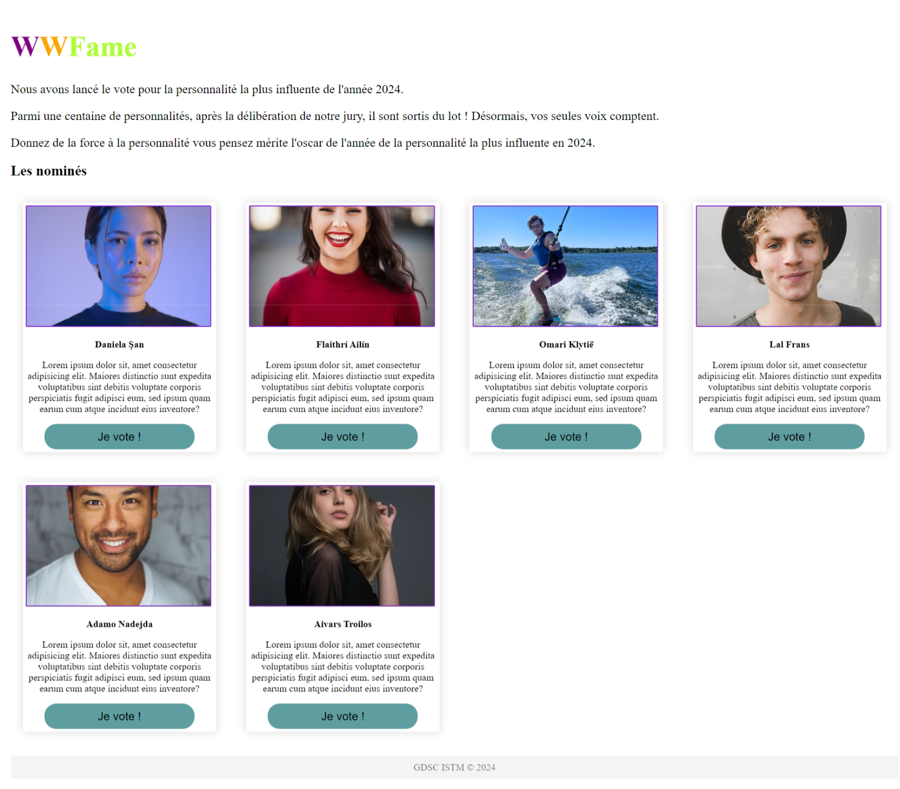

# POLLCHALL WWFame
Après la formation sur le Web qu'on a organisée au GDSC à l'Institut Supérieur de Technologie de Mamou du 13 au 19 Janvier 2023, nous avons voulu permettre aux membres de continuer à s'entrainer en leur proposant ce challenge.

Tenez vous-bien rien d'impossible mais, le challenge leur mettra en confrontation aux limites de notre apprentissage et leur permettra d'aller au delà des notions qu'on a abordées.

Pour un premier temps, juste du HTML et du CSS.

Il s'agit de reproduire à la perfection l'interface de l'application que voici ci-dessous en démonstration. Il s'agit d'une application de vote pour élire les meilleures personnalitées célèbres et influentes dans l'année.

Les objectifs à atteindre sont:

- [x] Le contenu HTML correct
- [x] Associer un unique fichier CSS qui contiendra les styles
- [x] Créer les blocs pour les candidats
- [x] Un click sur le boutton je vote pour chaque candidat doit transmettre à une page /vote.html l'identifiant du candidat cliqué. Cet identifiant ne doit pas être visible.
- [x] La page vote doit être créée.
- [x] Pour l'instant elle affiche juste l'image et les informations du premier candidat avec un message "Merci pour votre vote"
- [x] La page vote doit permettre de revenir à l'acceuil.
- [x] La page vote doit avoir du CSS et ressembler à quelque chose.
- [x] Créer une page d'erreurs qui renverra à l'acceuil.

### Démo

Voici à quoi devrait ressembler la page d'accueil

Suivez cette vidéo pour découvrir davantage

[Regardez la video](./WWFame%20Demo.mp4)

---

Bonne chance !